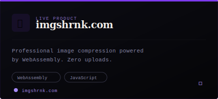

 

&nbsp;&nbsp;
&nbsp;&nbsp;
&nbsp;&nbsp;
&nbsp;&nbsp;

 

 

> *"Privacy is not about hiding — it's about choice."*

I'm a self-taught full stack engineer from **Karachi, Pakistan**, currently engineering at **Turingoid**. I build privacy-first digital products that respect users. 4+ years deep in Vue.js, Node.js, and end-to-end encryption. I debug to guitar solos. I ship things that matter.

 

 

 

<table border="0" cellpadding="0" cellspacing="12">
<tr>
<td>

</td>
<td>

</td>
</tr>
</table>

 

 

 

&nbsp;
&nbsp;
&nbsp;
&nbsp;
&nbsp;
&nbsp;
&nbsp;
&nbsp;

 

 

 

 

 

<table border="0" width="100%">
<tr>
<td width="15%" align="right" valign="top"><code>NOW</code></td>
<td width="3%" align="center" valign="top">▸</td>
<td width="82%"><b>Full Stack Engineer</b> — Turingoid Building production-grade full-stack applications. Vue.js · Node.js · MySQL</td>
</tr>
<tr><td colspan="3"> </td></tr>
<tr>
<td align="right" valign="top"><code>PREV</code></td>
<td align="center" valign="top">▸</td>
<td><b>Lead Full Stack Developer</b> — WebOptix (Swiss Agency) Led full-stack development for international clients with Swiss quality standards</td>
</tr>
<tr><td colspan="3"> </td></tr>
<tr>
<td align="right" valign="top"><code>PREV</code></td>
<td align="center" valign="top">▸</td>
<td><b>Full Stack Developer</b> — Orderain Feature development across frontend and backend product systems</td>
</tr>
<tr><td colspan="3"> </td></tr>
<tr>
<td align="right" valign="top"><code>ALWAYS</code></td>
<td align="center" valign="top">▸</td>
<td><b>Freelancer ⭐⭐⭐⭐⭐</b> — Fiverr 5-star rated · Vue.js, Node.js, custom web apps for global clients</td>
</tr>
</table>

 

 

  

 

