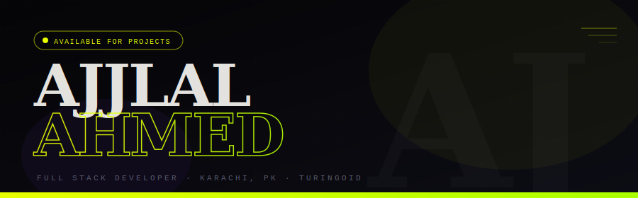
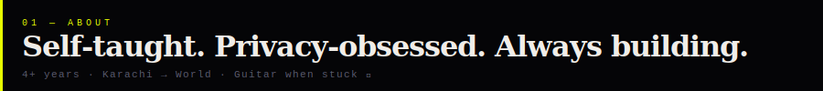
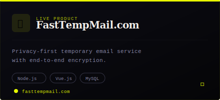
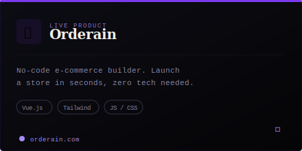
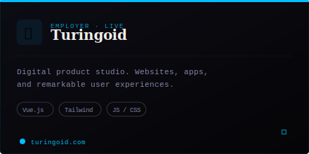
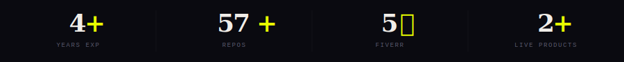

 

&nbsp;&nbsp;
&nbsp;&nbsp;
&nbsp;&nbsp;
&nbsp;&nbsp;

 

 

 

> *"Web development virtuoso, turning ideas into digital masterpieces."*

I'm a full-stack web developer passionate about crafting fast, secure, and user-friendly web applications. Whether it's frontend design or backend logic, I love building tools that are both functional and delightful to use.

My recent work includes **FastTempMail**, a privacy-focused temporary email service built for performance, and several other SaaS and side projects. I enjoy working on real-world problems — especially ones that help people save time, stay secure, or automate the boring stuff.

I'm part of a small startup (**Turingoid**), actively contributing across both frontend and backend — from architecture to pixel-perfect UI. It's a wild ride, and I'm all in for the growth, learning, and late-night debugging. Outside of work, I'm usually tinkering with new ideas or jamming on my guitar 🎸.

 

 

 

<table border="0" cellpadding="0" cellspacing="12">
<tr>
<td>

</td>
<td>

</td>
</tr>
<tr>
<td colspan="2" align="center">

</td>
</tr>
</table>

 

 

 

&nbsp;
&nbsp;
&nbsp;
&nbsp;
&nbsp;
&nbsp;
&nbsp;
&nbsp;
&nbsp;
&nbsp;

 

 

 

 

 

<table border="0" width="100%">
<tr>
<td width="15%" align="right" valign="top"><code>NOW</code></td>
<td width="3%" align="center" valign="top">▸</td>
<td width="82%"><b>Full Stack Engineer</b> — <a href="https://www.turingoid.com/">Turingoid</a> Contributing across frontend and backend — architecture, pixel-perfect UI, and everything in between. Vue.js · Node.js · Tailwind</td>
</tr>
<tr><td colspan="3"> </td></tr>
<tr>
<td align="right" valign="top"><code>PREV</code></td>
<td align="center" valign="top">▸</td>
<td><b>Lead Full Stack Developer</b> — WebOptix (Swiss Agency) Led full-stack development for international clients with Swiss quality standards. Delivered premium web solutions across the entire stack.</td>
</tr>
<tr><td colspan="3"> </td></tr>
<tr>
<td align="right" valign="top"><code>PREV</code></td>
<td align="center" valign="top">▸</td>
<td><b>Full Stack Developer</b> — <a href="https://orderain.com/">Orderain</a> Built and shipped the no-code e-commerce platform — template builder, store management, and full-stack feature development.</td>
</tr>
<tr><td colspan="3"> </td></tr>
<tr>
<td align="right" valign="top"><code>ALWAYS</code></td>
<td align="center" valign="top">▸</td>
<td><b>Freelancer ⭐⭐⭐⭐⭐</b> — <a href="https://www.fiverr.com/ajjlal_ahmed">Fiverr</a> 5-star rated across 14+ reviews. Vue.js, Node.js, custom web apps — serving clients from 🇩🇰 🇨🇭 🇬🇧 🇩🇪 🇷🇴 🇲🇻 and more.</td>
</tr>
</table>

 

 

 

<table border="0" width="100%">
<tr>
<td width="50%" valign="top">

> *"Must be a pro Vue developer with this amount of expertise"*
> 
> — **@frihauge** 🇩🇰 &nbsp; ⭐⭐⭐⭐⭐

 

> *"Ajjlal is a true legend and hard working developer. I keep going back to him, because of the effort and excellent job."*
> 
> — **@nulllq** 🇩🇰 &nbsp; ⭐⭐⭐⭐⭐

 

> *"This dude is absolutely awesome, he had to do so much in a short time and did it awesome!!! Would order again!!!!"*
> 
> — **@cam_erji12** 🇨🇭 &nbsp; ⭐⭐⭐⭐⭐

 

> *"Delivered the work perfectly much quicker than expected, with highly professional clean work."*
> 
> — **@suh3yl** 🇲🇻 &nbsp; ⭐⭐⭐⭐⭐

 

> *"Very hardworking and motivated programmer. He was patient with all my suggestions and feedback. I would hire again."*
> 
> — **@brianerdelyi** 🇧🇲 &nbsp; ⭐⭐⭐⭐⭐

 

> *"Very talented Vue frontend dev"*
> 
> — **@frihauge** 🇩🇰 &nbsp; ⭐⭐⭐⭐⭐

</td>
<td width="50%" valign="top">

> *"Amazing individual, replies instantly and did everything I requested."*
> 
> — **@zmusad** 🇬🇧 &nbsp; ⭐⭐⭐⭐⭐

 

> *"Very fast and professional. Recommended!"*
> 
> — **@whitebrand650** 🇷🇴 &nbsp; ⭐⭐⭐⭐⭐

 

> *"Super effective and a reliable team worker. Easy to communicate with and understands clients situation."*
> 
> — **@suh3yl** 🇲🇻 &nbsp; ⭐⭐⭐⭐⭐

 

> *"Best experience for quick fixes."*
> 
> — **@suh3yl** 🇲🇻 &nbsp; ⭐⭐⭐⭐⭐

 

> *"Very friendly and indeed, provides quality and efficient work."*
> 
> — **@suh3yl** 🇲🇻 &nbsp; ⭐⭐⭐⭐⭐

 

> *"Everything met our expectations."*
> 
> — **@christianjmader** 🇩🇪 &nbsp; ⭐⭐⭐⭐⭐

</td>
</tr>
</table>

 

 

  

 

